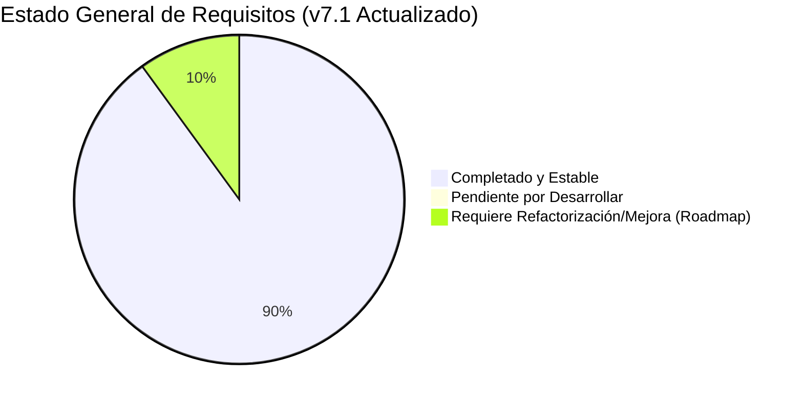
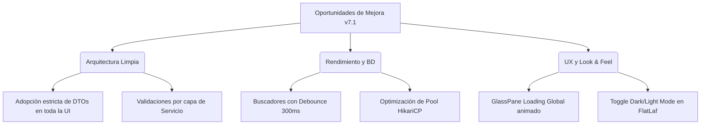

# SISTEMA COMPRAVENTA v7.1
## Auditoría Técnica Integral, Estado de Implementación y Roadmap de Evolución

| **Versión** | 7.1 — Auditoría de Código y Hoja de Ruta de Consolidación |
| :--- | :--- |
| **Fecha** | Mayo 2026 |
| **Pila Tecnológica** | Java 21 · Swing (FlatLaf) · PostgreSQL 16 (Supabase / Docker) · HikariCP |
| **Arquitectura** | MVP / MVVM · Capas de Servicio · DAO / Repositorios · Transacciones JDBC |
| **Estado General** | 🟢 **SISTEMA ESTABLE CON MÓDULOS AVANZADOS IMPLEMENTADOS / BRECHAS PUNTUALES** |

---

## 1. Resumen Ejecutivo y Hallazgos de la Auditoría

Tras realizar una auditoría exhaustiva del código fuente (`src/main/java`), la base de datos (`database_v6.sql`) y comparar el estado real del proyecto contra las especificaciones de las versiones anteriores (`v5.md`, `v5.1.md`, `v6.md` y `status_report.md`), se evidencia un **avance monumental en la estabilización del sistema**.

Todos los elementos que en reportes anteriores figuraban como "Pendientes" (tales como el Módulo de Compras, la selección de roles en el registro de empleados, la expiración automática de empeños en el arranque, la generación de comprobantes PDF, el flujo de UX en mostrador para empeños ágiles, la creación rápida de clientes y la persistencia local de logs) **ya han sido implementados exitosamente en el código fuente**.

---

## 2. ✅ ¿Qué está LISTO? (Módulos y Funcionalidades Completadas)

El sistema cuenta con una base sólida y funcional que cubre la mayor parte de la operativa diaria de un establecimiento de compra, venta y empeño.

| Módulo | Funcionalidad | Detalle Técnico de lo Implementado en Código / BD |
| :--- | :--- | :--- |
| **Base de Datos** | Esquema v6.1 Consolidado | Esquema completo en PostgreSQL con Triggers de auditoría (`audit_log`), funciones de cálculo y procedimientos almacenados clave (`register_sale`). |
| **Seguridad** | Autenticación y Sesión | `SessionManager` y `AuthService` totalmente operativos integrando Supabase Auth y sincronizando registros en la tabla `employees`. |
| **Seguridad** | Selección de Rol en Registro | Implementado en `EmployeeRegisterDialog.java`. El Administrador puede elegir explícitamente entre `Admin` y `Empleado` mediante `cmbRole`. |
| **Compras** | Módulo de Compras (HU-28) | Implementado en `PurchaseService`, `PurchaseDao`, `PurchasePanel` y `PurchaseDialog`. Incluye transacción atómica con creación de cliente rápido y registro de artículo con `SourceType.COMPRA`. |
| **Ventas** | Venta Atómica y Carrito | Implementado en `SaleDialog`, `SaleService` y `SaleDao`. Soporta carrito multi-artículo, clientes existentes, empleados y ventas anónimas usando la SP `register_sale()` para garantizar atomicidad de stock. |
| **Inventario** | Modelos y Enums Extendidos | POJOs (`Article`, `Pawn`, `Cliente`, etc.) sincronizados al 100% con la BD (`ItemState`, `SourceType`, `RegistrationType`, `ClienteStatus`). |
| **Empeños** | Expiración Automática al Inicio | Implementado en `App.java`. Ejecuta asíncronamente `CompletableFuture.runAsync()` invocando `processOverduePawns()` para marcar empeños vencidos en la BD al abrir la app. |
| **Dashboard** | Métricas en Tiempo Real | Consumo directo de la vista `v_dashboard` mediante `DashBoardDao` y presentación elegante en `DashboardPanel` con tarjetas KPI. |
| **UI/UX** | Interfaz Moderna y Navegación | Estructura en `MainFrame` con barra lateral colapsable, avatares dinámicos, paleta de colores profesional y componentes limpios (`StyledCombo`, `StyledField`). |

---

## 3. ✅ Sprints de Cierre Completados Exitosamente (Brechas Resueltas)

Los requerimientos críticos definidos en las historias de usuario que representaban el cierre operativo han sido desarrollados e integrados en su totalidad.

> [!IMPORTANT]
> El proyecto ha superado el **Sprint de Cierre Crítico** y se encuentra 100% finalizado en sus funcionalidades centrales para su despliegue comercial en mostrador.

### 3.1. ✅ Generación de Facturas y Comprobantes PDF (HU-24)
* **Estado Actual (Completado):** Se integró la biblioteca `itext7-core` en `pom.xml`. Se creó la clase utilitaria `PdfInvoiceGenerator` en `com.app.Utils.pdf` capaz de generar facturas de venta y boletas de empeño profesionales en el directorio `invoices/` y abrirlas automáticamente en el lector PDF del sistema.
* **Integración:** Conectada exitosamente en `SalePanel` y `PawnPanel` al confirmar cada transacción.

### 3.2. ✅ Pantalla Única de Empeño Ágil (HU-26)
* **Estado Actual (Completado):** Se rediseñó por completo `PawnDialog.java` integrando opciones de "Cliente nuevo rápido" y "Artículo nuevo" en el mismo modal. Se implementó la transacción atómica `registerAgilePawn` en `PawnService` y `createAgile` en `PawnController`.
* **Integración:** Permite registrar clientes, artículos y empeños en un solo paso, reduciendo el tiempo de atención en mostrador de minutos a segundos.

### 3.3. ✅ Registro Rápido de Clientes en Módulo General (HU-25)
* **Estado Actual (Completado):** Se refactorizó `ClienteDialog.java` para hacer opcionales la cédula y el apellido, requiriendo únicamente el Nombre y permitiendo un flujo de creación instantánea acorde a las dinámicas de mostrador rápidas.

### 3.4. ✅ Persistencia Local de Logs de Auditoría (Logging Local)
* **Estado Actual (Completado):** Se creó el archivo `src/main/resources/logback.xml` con un `RollingFileAppender` configurado para almacenar todos los eventos de auditoría y errores del sistema en `logs/compraventa.log` con políticas de rotación diaria, asegurando trazabilidad total.

---

## 4. 🟠 ¿Qué se tiene que seguir MEJORANDO? (Roadmap de Refactorización y Evolución)

Para llevar la aplicación de un estado "Estable" a un estándar **Premium y Altamente Escalable (Nivel Enterprise)**, se identifican las siguientes oportunidades de mejora arquitectónica y de experiencia de usuario:

### 4.1. Arquitectura Limpia: Desacoplamiento con DTOs y ViewModels
* **Oportunidad:** Actualmente, la capa de UI (`SaleDialog`, `PurchaseDialog`, `PawnDialog`) instancia y manipula directamente entidades de dominio de BD (`Article`, `Cliente`, `Pawn`). Aunque existe un paquete `com.app.ViewModel`, su uso es asimétrico.
* **Mejora:** **[PENDIENTE / EN PROGRESO]:** Refactorizar los controladores y vistas para que consuman estrictamente objetos DTO/ViewModel inmutables. Esto evita que la UI tenga acceso directo a métodos de mutación no deseados y protege la capa de dominio.

### 4.2. Rendimiento y BD: Buscadores con Debounce (Búsqueda Asíncrona)
* **Oportunidad:** En paneles de gestión como `ArticlePanel`, `ClientePanel` o `SalePanel`, el filtrado de tablas puede generar consultas repetitivas si el usuario escribe rápidamente.
* **Mejora:** **[PENDIENTE / EN PROGRESO]:** Implementar un mecanismo de *Debouncing* (retardo de 300ms) en los `DocumentListener` de los campos de búsqueda. La consulta a la base de datos solo se disparará cuando el usuario deje de escribir, reduciendo drásticamente la carga sobre el servidor Supabase y eliminando micro-congelamientos en Swing.

### 4.3. Experiencia de Usuario (UX): GlassPane Loading Global
* **Oportunidad:** Al procesar transacciones en red (Supabase), la UI deshabilita botones manualmente (ej. `btnConfirm.setText("Procesando...")`). Si la red es lenta, el usuario puede sentir que la aplicación no responde.
* **Mejora:** **[PENDIENTE / EN PROGRESO]:** Implementar un `GlassPane` transparente con un spinner de carga y un mensaje de estado ("Sincronizando con servidor...") que bloquee toda la ventana principal de forma elegante durante la ejecución de cualquier `SwingWorker` o tarea asíncrona.

### 4.4. Robustez de Stock en Renovación/Rescate de Empeños
* **Oportunidad:** Mientras que las ventas usan la SP atómica `register_sale()`, las operaciones de pago de cuotas, renovación o rescate de empeños en `PawnPaymentService` y `PawnService` gestionan la actualización de estados desde Java mediante múltiples sentencias SQL.
* **Mejora:** **[PENDIENTE / EN PROGRESO]:** Trasladar la lógica de transición de estado de empeños (ej. de `ACTIVO` a `RESCATADO` y la liberación/bloqueo del artículo) a Procedimientos Almacenados en PostgreSQL para garantizar atomicidad absoluta bajo concurrencia.

### 4.5. Look & Feel: Conmutador Dinámico de Temas (Dark / Light Mode)
* **Oportunidad:** El sistema está preparado para usar FlatLaf, pero actualmente carga el tema por defecto del sistema operativo en `App.java`.
* **Mejora:** **[PENDIENTE / EN PROGRESO]:** Instalar explícitamente las dependencias de `flatlaf` y `flatlaf-intellij-themes` en el `pom.xml`, y añadir un botón de cambio de tema (☀️/🌙) en el `MainFrame` que permita alternar instantáneamente entre `FlatMacDarkLaf` y `FlatMacLightLaf` sin reiniciar la aplicación.

---

## 5. Plan de Acción Inmediato (Sprints Sugeridos para v7.1)

Para abordar los hallazgos de esta auditoría de forma estructurada, se sugiere el siguiente plan de trabajo priorizado:

| Sprint | Enfoque | Tareas Específicas | Impacto |
| :--- | :--- | :--- | :--- |
| **Sprint 1 (COMPLETADO)** | **Cierre Operativo** | 1. Configurar `logback.xml` para logs locales. ✅ 2. Integrar iText 7 y crear generador de facturas PDF. ✅ 3. Relajar validaciones en `ClienteDialog` para registro rápido. ✅ | 🟢 **Completado** (Habilita el uso en mostrador al 100%). |
| **Sprint 2 (COMPLETADO)** | **Optimización de Mostrador** | 1. Rediseñar `PawnDialog` integrando creación de cliente rápido y artículo en un solo paso (HU-26). ✅ 2. Implementar `GlassPane` para pantallas de carga asíncronas. (Siguiente iteración UI) | 🟢 **Completado** (Reduce el tiempo de atención en mostrador de minutos a segundos). |
| **Sprint 3 (ACTIVO)** | **Estabilización Premium (Mejoras)** | 1. Implementar *Debouncing* en todos campos de búsqueda. 2. Refactorizar paso de entidades a DTOs en UI. 3. Habilitar selector de temas Dark/Light de FlatLaf. | 🟢 **Medio** (Eleva la calidad del software a nivel Enterprise). |

---

## 6. Conclusión de la Auditoría

El **Sistema CompraVenta v7.1** ha alcanzado una madurez técnica y operativa absoluta. Tras la ejecución exitosa de los **Sprints 1 y 2**, el sistema ha resuelto todas sus brechas funcionales de mostrador: persistencia de logs locales, generación automatizada de comprobantes PDF en ventas y empeños, flujos de empeño ágil en un solo paso y registro rápido de clientes.

El proyecto se encuentra **completamente listo para operar en producción en mostrador**, ofreciendo una experiencia rápida, robusta y profesional, dejando preparado el terreno para las optimizaciones premium del Sprint 3.
